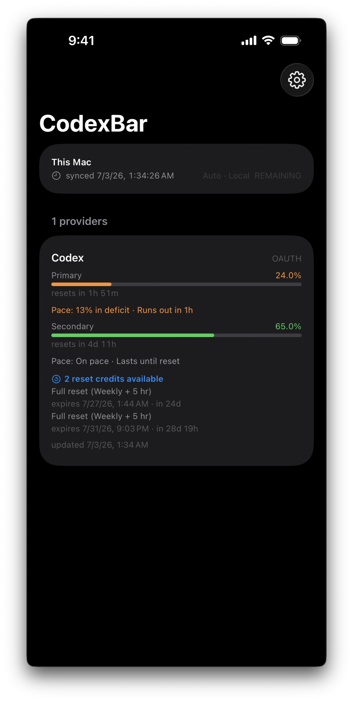
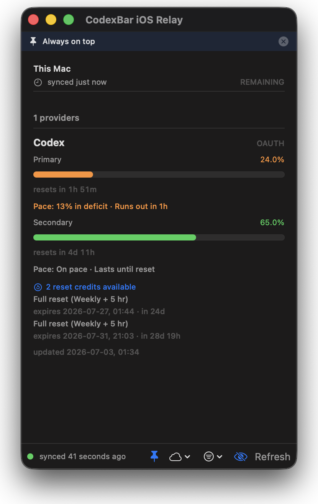

# CodexBar iOS Relay

Shows your [CodexBar](https://github.com/steipete/CodexBar) usage on iPhone by running a small host app on your Mac.

Supports:
- local LAN discovery via Bonjour
- optional iCloud Drive snapshot sync

## Status
- Experimental and not fully tested.
- Use at your own risk.
- Tailscale / remote access is unverified.
- If you run more than one host on the same LAN, the iPhone currently adopts the first Bonjour result it sees.

## Requirements
- `codexbar` installed on the Mac
- Xcode 26
- Mac and iPhone on the same Wi‑Fi for LAN mode

## Run
```sh
xcodegen generate
open CodexBarRelay.xcodeproj
```

In Xcode:
1. Change `com.changeme.*` bundle IDs in `project.yml`.
2. Set your signing team in Xcode before building to your devices.
3. Run `CodexBarSyncMac` on your Mac.
4. Run `CodexBarSynciOS` on your iPhone.

For iPhone installs, you need to pick your own Development Team for the iOS target.

## Screenshots
Turn on **Hide personal information** before taking screenshots. It hides account emails and the host name.

<table>
  <tr>
    <td align="center"><br/><sub>iPhone</sub></td>
    <td align="center"><br/><sub>macOS</sub></td>
  </tr>
</table>
